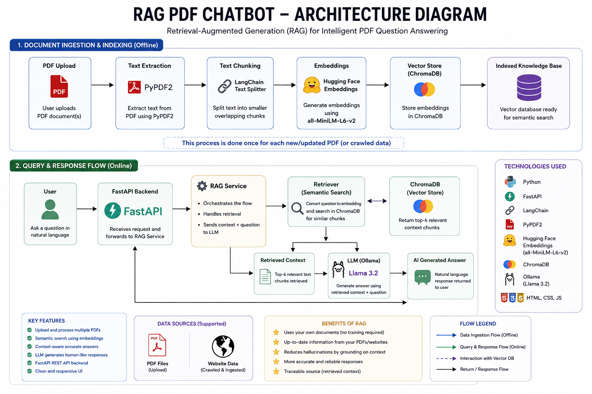
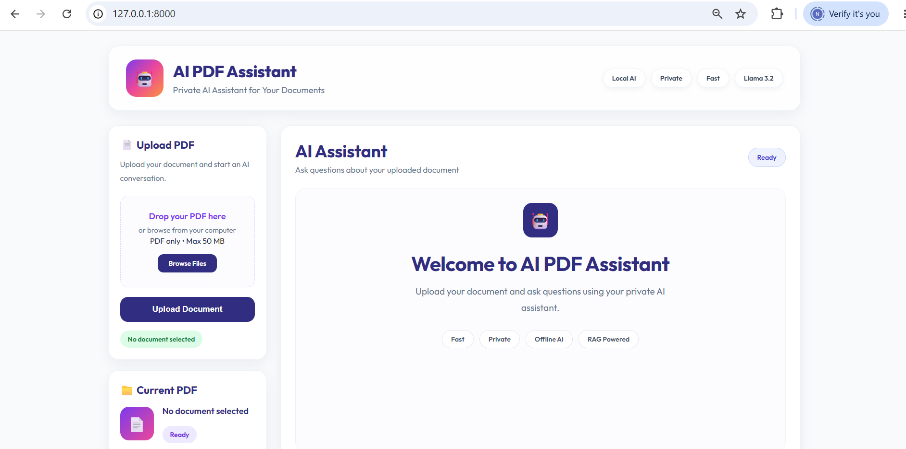
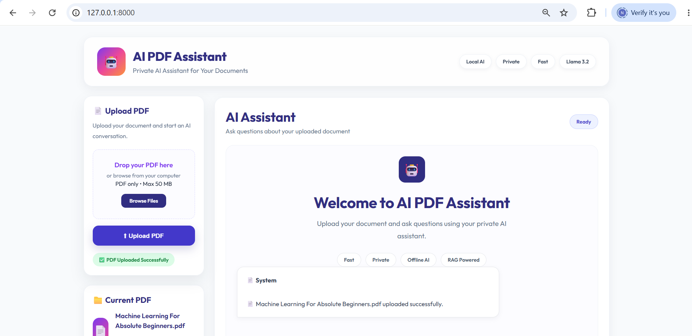
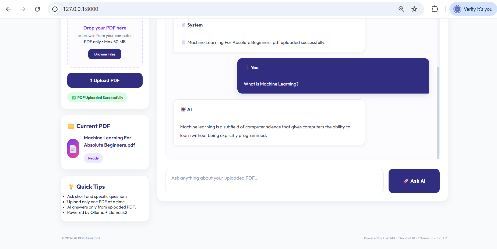

# AI PDF Chatbot

An AI-powered chatbot that answers questions from PDF documents using Retrieval-Augmented Generation (RAG).

## Overview

This project allows users to upload PDF documents and ask questions in natural language. The chatbot retrieves relevant information from the uploaded PDF using semantic search and generates answers using Ollama (Llama 3.2).

## Features

- Upload PDF documents
- Extract text from PDFs
- Generate embeddings using Hugging Face
- Store embeddings in ChromaDB
- Semantic search
- AI-powered question answering
- FastAPI backend
- Docker support

## Tech Stack

- Python
- FastAPI
- LangChain
- Hugging Face Embeddings
- ChromaDB
- Ollama (Llama 3.2)
- PyPDF2
- HTML, CSS, JavaScript
- Docker

## Architecture



## Screenshots

### Home Page


### Upload PDF


### AI Response


## Installation

```bash
git clone https://github.com/vibhashrisole/RAG_PDF_Chatbot.git
cd RAG_PDF_Chatbot
pip install -r requirements.txt
uvicorn app.main:app --reload
```

## Future Improvements

- Support multiple PDFs
- Chat history
- User authentication
- OpenAI integration

## Author

**Vibhashri Sole**